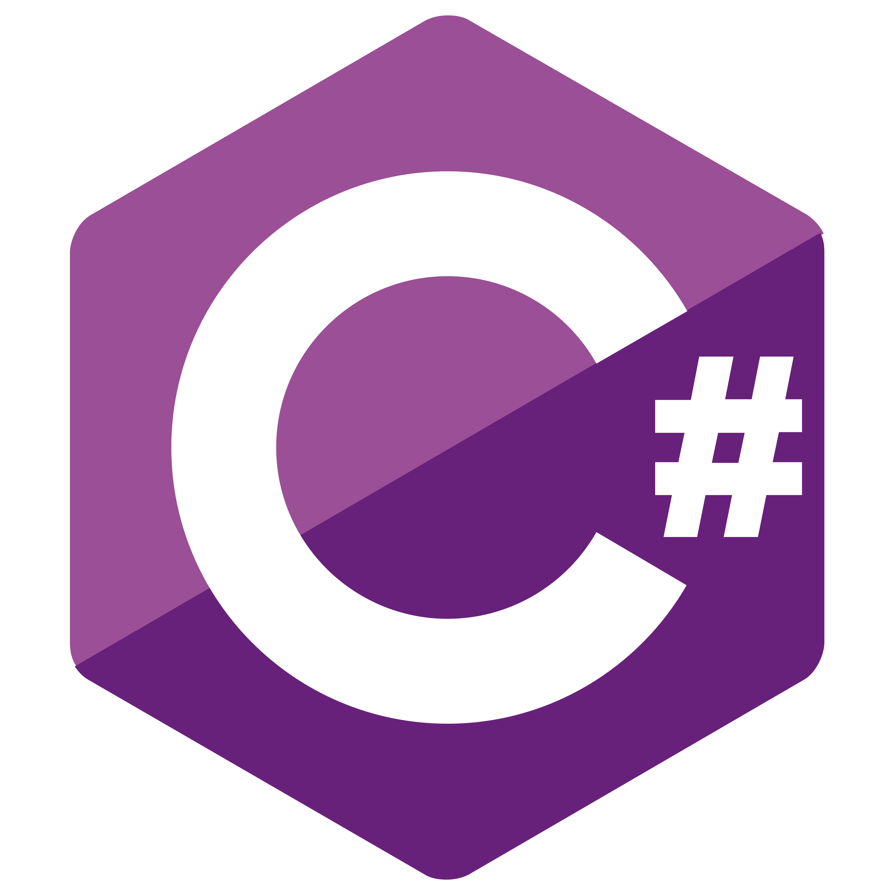

#  CodeEditor.

CodeEditor is an online code editor that supports multiple programming languages, including JavaScript, TypeScript, PHP, Java, Python, and C#. The editor allows users to write code, save it, and switch themes (for both the editor and the main page).

## Technologies

- **React**: for building the interface
- **JavaScript**: the main programming language
- **Monaco Editor**: for code editing
- **CSS**: for styling and themes
- **LocalStorage**: for saving code and themes.

## Features

- Write code in the following languages: 
  1.  JavaScript   
  2.  TypeScript  
  3.  PHP  
  4.  Java   
  5.  Python  
  6.  C#  

- Saving code and themes in the browser using LocalStorage
